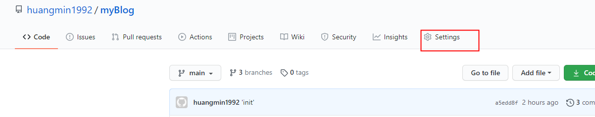
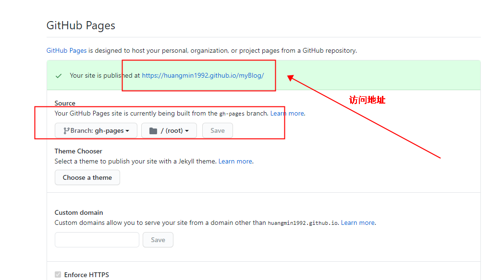

# vuepress 部署到github-pages

[vuepress官网](https://www.vuepress.cn/guide/)

### 首先在根目录下建立一个文件：deploy.sh
______________________


1.文件内容如下：
```sh
#!/usr/bin/env sh

# 确保脚本抛出遇到的错误
set -e

# 生成静态文件
npm run docs:build

# 进入生成的文件夹
cd docs/.vuepress/dist

# 如果是发布到自定义域名
# echo 'www.example.com' > CNAME

git init
git add -A
git commit -m 'deploy'

# 如果发布到 https://<USERNAME>.github.io
# git push -f git@github.com:<USERNAME>/<USERNAME>.github.io.git master

# 如果发布到 https://<USERNAME>.github.io/<REPO>
# git push -f git@github.com:<USERNAME>/<REPO>.git master:gh-pages

git push -f git@github.com:huangmin1992/myBlog.git master:gh-pages

cd -
```
2.在package.json中修改如下
```json
 "scripts": {
    "docs:dev": "vuepress dev docs",
    "docs:build": "vuepress build docs",
    "deploy": "bash deploy.sh"
  },
```
3.然后运行,注意:需要在右键启动git bash 运行此命令;
```javascript
npm run deploy
```
如果报错：有可能是ssh过期
```javascript
Please make sure you have the correct access rights
and the repository exists.
npm ERR! code ELIFECYCLE
npm ERR! errno 128
npm ERR! my-vuepress@1.0.0 deploy: `bash deploy.sh`
```
##### 解决方案：
找到.ssh文件夹，路径：C:\Users\Administrator\.ssh
然后执行命令
```javascript
ssh-keygen
```
生成秘钥：复制id_rsa.pub中的内容，进入https://github.com/settings/keys新增秘钥，然后再执行`npm run deploy`即可成功;

4.进入github仓库,如下图：



