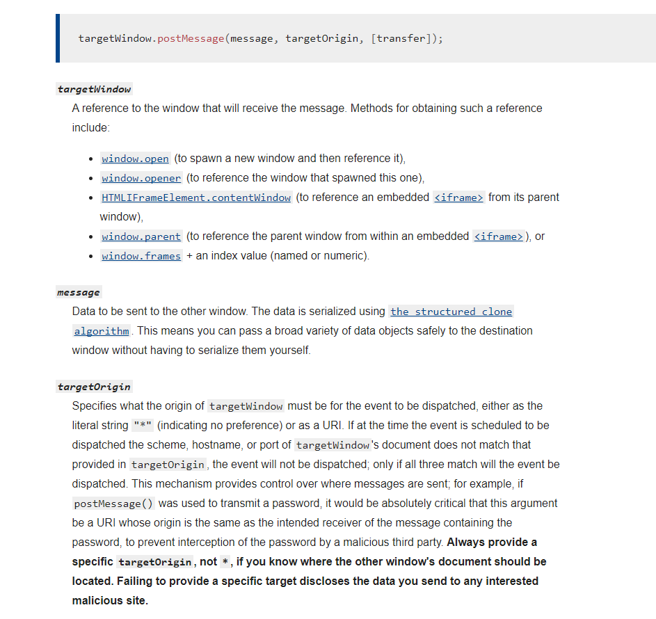
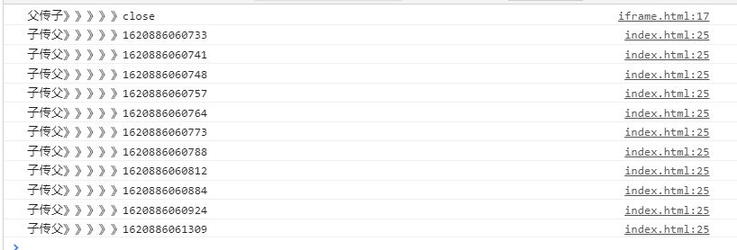

## 入口：web/h5

``` javascript
export const browserRedirect = () => {
    let sUserAgent = navigator.userAgent.toLowerCase();
    let isMobile = false;
    let bIsIpad = sUserAgent.match(/ipad/i) == 'ipad';
    let bIsIphoneOs = sUserAgent.match(/iphone os/i) == 'iphone os';
    let bIsMidp = sUserAgent.match(/midp/i) == 'midp';
    let bIsUc7 = sUserAgent.match(/rv:1.2.3.4/i) == 'rv:1.2.3.4';
    let bIsUc = sUserAgent.match(/ucweb/i) == 'ucweb';
    let bIsAndroid = sUserAgent.match(/android/i) == 'android';
    let bIsCE = sUserAgent.match(/windows ce/i) == 'windows ce';
    let bIsWM = sUserAgent.match(/windows mobile/i) == 'windows mobile';
    isMobile = bIsIpad || bIsIphoneOs || bIsMidp || bIsUc7 || bIsUc || bIsAndroid || bIsCE || bIsWM;
    return isMobile;
};
```

## 时间格式化

``` javascript
export function formatDate(date, fmt) {
    var o = {
        "M+": date.getMonth() + 1, //月份
        "D+": date.getDay(), //日
        "h+": date.getHours(), //hours
        "m+": date.getMinutes(), //分钟
        's+': date.getSeconds(), //秒,
    }

    if (/(y+)/.test(fmt)) {
        //RegExp.$1 是RegExp的一个属性,指的是与正则表达式匹配的第一个 子匹配(以括号为标志)字符串，以此类推，RegExp.$2，RegExp.$3，..RegExp.$99总共可以有99个匹配
        fmt = fmt.replace(RegExp.$1, (date.getFullYear() + '').substr(4 - RegExp.$1.length));
    }
    for (var k in o) {
        if (new RegExp("(" + k + ")").test(fmt)) {
            fmt = fmt.replace(RegExp.$1, (RegExp.$1.length === 1) ? (o[k]) : (("00" + o[k]).substr(("" + o[k]).length)))
        }
    }
    return fmt;
}

调用：
项目中：
import {
    formatDate
} from "./formatDate.js"
js中： formate(new Date(), 'yyyy-MM-DD hh:mm:ss')
```

## 复制到剪贴板

``` javascript
  // 复制链接
  copyLinkHandler() {
      const input = document.querySelector('#private-link-code');
      input.value = this.copyLinkTxt;
      // 选中赋值过的input
      input.select();
      document.execCommand('Copy');
  }
```

## 点击开启新标签窗口

``` javascript
 /**

  + @param { string } url
  + @param { string } windowName
  + @param { number } width
  + @param { number } height

  */
 export function openWindow(url, windowName, width, height) {
     var x = parseInt(screen.width / 2.0) - width / 2.0;
     var y = parseInt(screen.height / 2.0) - height / 2.0;
     var isMSIE = navigator.appName == "Microsoft Internet Explorer";
     if (isMSIE) {
         var p = "resizable=1,location=no,scrollbars=no,width=";
         p = p + width;
         p = p + ",height=";
         p = p + height;
         p = p + ",left=";
         p = p + x;
         p = p + ",top=";
         p = p + y;
         window.open(url, windowName, p);
     } else {
         var win = window.open(
             url,
             "ZyiisPopup",
             "top=" +
             y +
             ",left=" +
             x +
             ",scrollbars=" +
             scrollbars +
             ",dialog=yes,modal=yes,width=" +
             width +
             ",height=" +
             height +
             ",resizable=no"
         );
         eval("try { win.resizeTo(width, height); } catch(e) { }");
         win.focus();
     }
 }
```

## post 请求，responseType为blob, 后端返回文件流，前端进行转换下载

请求接口时，请求类型设置为blob；responseType:'blob', 将后端返回的文件流进行转换为ulr，新开窗口下载
```javascript   

    let reader = new FileReader(); // 创建读取文件对象
    let result: any;
    reader.addEventListener('loadend', () => {
    if (typeof reader.result === 'string') {
        try {
        result = JSON.parse(reader.result);
        } catch (e) {
        result = undefined;
        }
    } // 返回的数据
    if (result && result.code) {
        this.message.error(result.message);
        this.packageDownloadVisible = false;
        return;
    }
    const date = formatDate(new Date(), 'yyyy-MM-dd HH ：mm', 'zh-CN');
    let blob = new Blob([res], {type: 'application/zip'});
    if (window.navigator.msSaveOrOpenBlob) {
        if (navigator.userAgent.indexOf('Firefox') >= 0
        // @ts-ignore
        || (navigator.userAgent.toLocaleLowerCase().indexOf('trident')) >= 0) {
        navigator.msSaveBlob(blob, date + ' ' + this.translate.instant('package-files') + '.zip');
        } else {
        navigator.msSaveBlob(blob, date + ' ' + this.translate.instant('package-files'));
        }
    } else {
        const link = document.createElement('a');
        const body = document.querySelector('body');
        link.href = window.URL.createObjectURL(blob);
        link.download = date + ' ' + this.translate.instant('package-files');
        // fix Firefox,ie11
        if (navigator.userAgent.indexOf('Firefox') >= 0
        // @ts-ignore
        || (navigator.userAgent.toLocaleLowerCase().indexOf('trident')) >= 0) {
        link.download = date + ' ' + this.translate.instant('package-files') + '.zip';
        }
        link.style.display = 'none';
        body.appendChild(link);
        link.click();
        body.removeChild(link);
        window.URL.revokeObjectURL(link.href);

    }
    this.packageDownloadVisible = false;
    });
    reader.readAsText(res, 'utf-8');

``` 

## Debounce（防抖） and Throttle（节流）

```javascript
// Debounce

const debounce = (fn,delay)=>{
    return args=>{
        clearTimeout(fn.id);
        fn.id = setTimeout(()=>{
            fn.call(this,args);
        },delay)
    }
}

const debounce = (func, wait, immediate) => {
            let timeOut;
            return function () {
                const context = this;
                const args = arguments;
                if (timeOut) {
                    clearTimeout(timeOut);
                }
                if (immediate) {
                    let callNow = !timeOut;
                    timeOut = setTimeout(() => {
                        timeOut = null;
                    }, wait || 500)
                    if (callNow) {
                        func.apply(context, args);
                    }
                } else {
                    timeOut = setTimeout(() => {
                        func.apply(context, args);
                    }, wait || 500);
                }

            }
        }
// 调用
const test = debounce(fn,1000);

// Throttle

const throttle = (fn,delay)=>{
    return  args=>{
        if(fn.id){
            return;
        }
        fn.id = setTimeout(()=>{
            fn.call(this,args);
            clearTimeout(fn.id);
            fn.id = null;
        },delay)
    }
}

// 调用
const test = throttle(fn,1000);

// throttle 加入时间戳
const throttle = (fn,delay)=>{
    let las = 0;
    return args =>{
        let now = Date.now();
        if(last && now < last + delay){
            clearTimeout(fn.id);
            fn.id = setTimeout(()=>{
                fn.call(this,args);
                last = now;
            },delay);
            
        }else{
            fn.call(this,args);
            last = now;
        }
    }
}

 // 及时触发，停止触发
const throttle = (func, wait) => {
    let args, context, timeout, previous = 0;
    const later = () => {
        previous = +new Date();
        timeout = null; // 清除闭包
        func.apply(context, args);
    }
    return function () {
        context = this;
        args = arguments;
        let now = +new Date();
        // 下次触发func剩余的时间
        let remaining = wait - (now - previous);
        // 如果没有剩余或者需改了系统时间
        if (remaining <= 0 || remaining > wait) {
            if (timeout) {
                clearTimeout(timeout);
                timeout = null;
            }
            previous = now;
            func.apply(context, args);
        } else if (!timeout) {
            timeout = setTimeout(later, wait);
        }
    }
}

```

## 分时函数

#### 如果一次向加载上千条数据，dom可能卡顿，分时函数可分批进行

``` javascript
const timeChunk = (arr, fn, count) => {
    let t, len = arr.length;
    const start = () => {
        for (let i = 0; i < Math.min(count || 1, len); i++) {
            fn(arr.shift());
        }
    };
    return () => {
        t = setInterval(() => {
            if (arr.length === 0) {
                return clearInterval(t);
            }
            start();
        }, 200)
    }
}
const renderData = timeChunk(arr, () => {
    // 回调函数，在里面执行操作
}, count);
```

## hmtl字符转义与反转义

``` javascript
// 普通标签转义
const html2Escape = (params: string) => {
    const obj = {
        '<': '&lt;',
        '>': '&gt;',
        '&': '&amp;',
        '"': '&quot;'
    }
    return params.replace(/[<>&"]/g, (t) => {
        return obj[c];
    })
}
// 转义符换成普通标签
const escape2Html = (params: string) => {
    const obj = {
        'lt': '<',
        'gt': '>',
        'nbsp': ' ',
        'amp': '&',
        'quot': '"'
    };
    return params.replace(/&(lt|gt|nbsp|amp|quot);/ig, (all, t) => {
        return obj[t];
    })
}
```

## <code>targetWindow.postMessage()</code>

* 解决父子页面传信，界面与iframe跨域传信问题
* MAN中有详解：[MDN中有详解](https://developer.mozilla.org/en-US/docs/Web/API/Window/postMessage)
* <code>targetWindow.postMessage(message, targetOrigin, [transfer])</code>; <code>targetWindow</code>: 字向上传递消息时，可以用<code>window.parenttargetOrigin</code>: 可写同源域名，也可写具体域名地址，也可用‘*’号；



1. 首先建立页面index.html,代码如下：

``` html
<!DOCTYPE html>
<html lang="en">

<head>
    <meta charset="UTF-8">
    <meta name="viewport" content="width=device-width, initial-scale=1.0">
    <meta http-equiv="X-UA-Compatible" content="ie=edge">
    <title>父页面</title>
</head>

<body>
    <button onclick="handleEvent()">向子页面发送信息</button>
    <p>我是父页面</p>
    <iframe src="iframe.html" id="iframe"></iframe>
    <script>
        function handleEvent() {
            // iframe的id
            var f = document.getElementById('iframe');
            // 触发子页面的监听事件
            f.contentWindow.postMessage('close', '*');
        }

        // 注册消息事件监听，接受子元素给的数据
        window.addEventListener('message', (e) => {
            console.log(e.data);
        }, false);
    </script>
</body>

</html>
```

2. 建立iframe.html子页面

``` html
<!DOCTYPE html>
<html lang="en">

<head>
    <meta charset="UTF-8">
    <meta name="viewport" content="width=device-width, initial-scale=1.0">
    <meta http-equiv="X-UA-Compatible" content="ie=edge">
    <title>子页面</title>
</head>

<body>
    <button onclick="handleEvent()">向父页面发送信息</button>
    <p>我是子页面</p>
    <script>
        // 注册消息事件监听，接受父元素给的数据
        window.addEventListener('message', (e) => {
            console.log(e.data);
        }, false);
        window.addEventListener('click', handleEvent, false);
        window.addEventListener('mousemove', handleEvent, false);
        window.addEventListener('keydown', handleEvent, false);
        window.addEventListener('mousedown', handleEvent, false);

        function handleEvent() {
            // 触发父页面的监听事件
            window.parent.postMessage(+new Date(), '*');
        }
    </script>
</body>

</html>
```
监听iframe界面操作，向上发送时间戳，更新动作。

这样就可以完美解决监听不到iframe窗体动作的问题了~~~